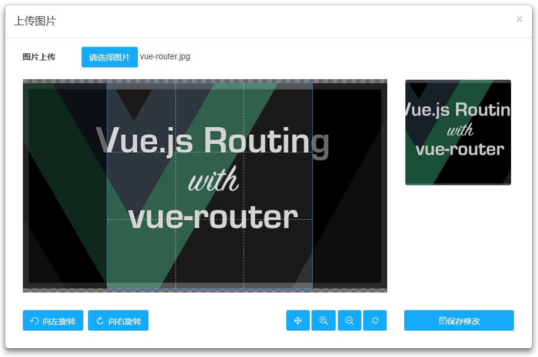

# 三镇网络科技有限公司

## 图片裁剪（Cropper）功能
>`jQuery`、`Bootstrap Modal`、`Cropper`、`html2canvas`

## How to use it
* 引入资源（直接引入）
``` html
 <script src="https://cdn.bootcss.com/jquery/1.12.4/jquery.js"></script>

 <link href="https://cdn.bootcss.com/bootstrap/3.3.6/css/bootstrap.min.css" rel="stylesheet" />
 <script src="https://cdn.bootcss.com/bootstrap/3.2.0/js/modal.min.js"></script>

 <link href="https://cdn.bootcss.com/cropper/2.3.4/cropper.min.css" rel="stylesheet" />
 <script src="https://cdn.bootcss.com/cropper/2.3.4/cropper.min.js"></script>
 <script src="https://cdn.bootcss.com/html2canvas/0.4.1/html2canvas.min.js"></script>
```

* 自定义样式及主函数（直接引入）
```html
<link href="css/customCropper.css" rel="stylesheet" />
<script src="js/customCropper.js"></script>
```

* HTML结构（直接引入）
 ```html
 <!-- 触发点击弹窗 -->
 <button type="button" class="btn customBlue"  data-toggle="modal" data-target="#avatar-modal" style="margin: 10px;">修改头像</button>

 <!-- 弹窗内容 - 开始 -->
 <div class="modal fade" id="avatar-modal" aria-hidden="true" aria-labelledby="avatar-modal-label" role="dialog" tabindex="-1">
    <div class="modal-dialog modal-lg">
        <div class="modal-content">
            <form class="avatar-form">
                <div class="modal-header">
                    <button class="close" data-dismiss="modal" type="button">&times;</button>
                    <h4 class="modal-title" id="avatar-modal-label">上传图片</h4>
                </div>
                <div class="modal-body">
                    <div class="avatar-body">
                        <div class="avatar-upload">
                            <input class="avatar-src" name="avatar_src" type="hidden">
                            <input class="avatar-data" name="avatar_data" type="hidden">
                            <label for="avatarInput" style="line-height: 35px;">图片上传</label>
                            <button class="btn customBlue"  type="button" style="height: 35px;" onClick="$('input[id=avatarInput]').click();">请选择图片</button>
                            <span id="avatar-name"></span>
                            <input class="avatar-input hide" id="avatarInput" name="avatar_file" type="file"></div>
                        <div class="row">
                            <div class="col-md-9">
                                <div class="avatar-wrapper"></div>
                            </div>
                            <div class="col-md-3">
                                <div class="avatar-preview preview-lg" id="imageHead"></div>
                                <!--<div class="avatar-preview preview-md"></div>
                                <div class="avatar-preview preview-sm"></div>-->
                            </div>
                        </div>
                        <div class="row avatar-btns">
                            <div class="col-md-4">
                                <div class="btn-group">
                                    <button class="btn customBlue icon-undo" data-method="rotate" data-option="-90" type="button"> 向左旋转</button>
                                </div>
                                <div class="btn-group">
                                    <button class="btn customBlue icon-repeat" data-method="rotate" data-option="90" type="button"> 向右旋转</button>
                                </div>
                            </div>
                            <div class="col-md-5" style="text-align: right;">
                                <button class="btn customBlue icon-arrows" data-method="setDragMode" data-option="move" type="button" title="移动"></button>
                                <button type="button" class="btn customBlue icon-search-plus" data-method="zoom" data-option="0.1" title="放大图片"></button>
                                <button type="button" class="btn customBlue icon-search-minus" data-method="zoom" data-option="-0.1" title="缩小图片"></button>
                                <button type="button" class="btn customBlue icon-refresh" data-method="reset" title="重置图片"></button>
                            </div>
                            <div class="col-md-3">
                                <button class="btn customBlue btn-block avatar-save icon-save" type="button"> 保存修改</button>
                            </div>
                        </div>
                    </div>
                </div>
            </form>
        </div>
    </div>
</div>
```

* 执行函数（根据业务需求，配置相关信息及回调函数即可）
```html
 <script type="text/javascript">

	$(".avatar-save").on("click", function() {
		var img_lg = document.getElementById('imageHead');
		html2canvas(img_lg, {
			allowTaint: true,
			taintTest: false,
			onrendered: function(canvas) {
				canvas.id = "mycanvas";
				var dataUrl = canvas.toDataURL("image/jpeg");
				var newImg = document.createElement("img");
				newImg.src = dataUrl;
				fn.imagesAjax({
					'url':'http://www.domain.com/updata.php',  // 配置后台上传地址
					'data':{                                   // 配置后台上传AJAX的data属性
						'img':dataUrl                          // 图片是 dataUrl
					}
				},function(){
					alert('上传成功啦！');			// 上传成功后的回调函数
				})
			}
		});
	})	

 </script>
```

## 资源网站
* Cropper插件：`https://github.com/fengyuanchen/cropper`
* UI参考：`http://www.sucaihuo.com/jquery/12/1289/demo/`

## UI设计


## 说明
* 营销官网：`http://www.threetowns.cn`
* 技术支持：`http://www.flowerboys.cn`

## 技术支持
>[三镇网络技术有限公司](http://www.threetowns.cn)，专注于网络营销、电子商务和企业定制化建站服务，把正确的营销方向当作一种使命，帮助客户提供专业的网络营销方案。其雄厚的实力，专业的营销团队一直活跃于各大电子商务平台的前线。

***

## 联系方式

* EMAIL联系方式：`threetowns@163.com`

| 官方网站 | 技术微信 | 技术QQ | QQ交流群 |
|--------|--------|--------|--------|
|||        |        |
