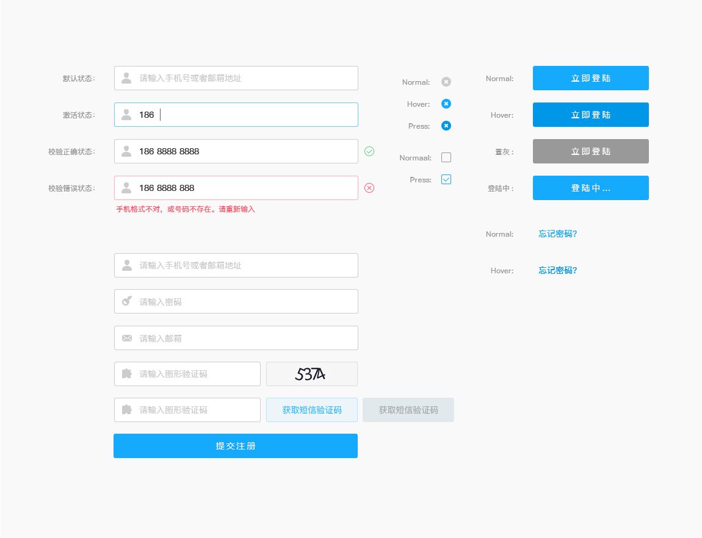

# 表单验证插件

## 使用说明
* 引入css
```html
<link rel="stylesheet" href="css/form.css">
```

* 引入js
```html
<script src="http://apps.bdimg.com/libs/jquery/1.9.1/jquery.min.js"></script>
<script src="js/Validform_v5.3.2_min.js"></script>
```

* 给需要验证的表单绑定附加属性
```html
<form class="J_validform">
	<input type="text" placeholder="请输入图形验证码" datatype="*">
	<input type="text" placeholder="请输入手机号" datatype="m">
	<input type="text" placeholder="请输入邮箱" datatype="e">
</form>
```

* 初始化
```javascript
$(function(){
	$(".J_validform").Validform();
})
```

## 附加属性
>可以绑定的附加属性有：`datatype`、`nullmsg`、`sucmsg`、`errormsg`、`ignore`、`recheck`、`tip`、`altercss`、`ajaxurl` 和 `plugin`

#### datatype属性
>凡要验证格式的元素均需绑定`datatype`属性，datatype可选值内置有10类，用来指定不同的验证格式。

* 内置datatype类型
>内置基本的 datatype 类型有： `*`、`*6-16`、`n`、`n6-16`、`s`、`s6-18`、`p`、`m`、`e`、`url`

 * `*`：检测是否有输入，可以输入任何字符，不留空即可通过验证；
 * `*6-16`：检测是否为6到16位任意字符；
 * `n`：数字类型；
 * `n6-16`：6到16位数字；
 * `s`：字符串类型；
 * `s6`-18：6到18位字符串；
 * `p`：验证是否为邮政编码；
 * `m`：手机号码格式；
 * `e`：email格式；
 * `url`：验证字符串是否为网址。

* 自定义datatype
>自定义 datatype 的名称，可以由`字母、数字、下划线、中划线和*号`组成。

 * `*6-16`的datatype，Validform会自动扩展，可以指定任意的数值范围。如内置基本类型有`*6-16`，那么你绑定`datatype="*4-12"`，就表示`4到12位任意字符`。
 * 如果你自定义了一个`datatype="zh2-4"`，表示`2到4位中文字符`，那么`datatype="zh2-6"`就表示`2到6位中文字符`。
 * 用","分隔表示规则累加；如：`datatype="zh,s2-4"`，表示要`符合自定义类型"zh"，也要符合规则"s2-4"`
 * 用"|"分隔表示规则多选一，即只要符合其中一个规则就可以通过验证，绑定的规则会依次验证，只要验证通过，后面的规则就会忽略不再比较。如绑定`datatype="m|e"`，表示既`可以填写手机号码，也能填写邮箱地址`，如果知道填入的是手机号码，那么就不会再检测他是不是邮箱地址；。


## UI设计


***

## 说明
* 营销官网：`http://www.threetowns.cn`
* 技术支持：`http://www.flowerboys.cn`

## 技术支持
>[三镇网络技术有限公司](http://www.threetowns.cn)，专注于网络营销、电子商务和企业定制化建站服务，把正确的营销方向当作一种使命，帮助客户提供专业的网络营销方案。其雄厚的实力，专业的营销团队一直活跃于各大电子商务平台的前线。

## 联系方式

* EMAIL联系方式：`threetowns@163.com`

| 官方网站 | 技术微信 | 技术QQ | QQ交流群 |
|--------|--------|--------|--------|
|||        |        |
